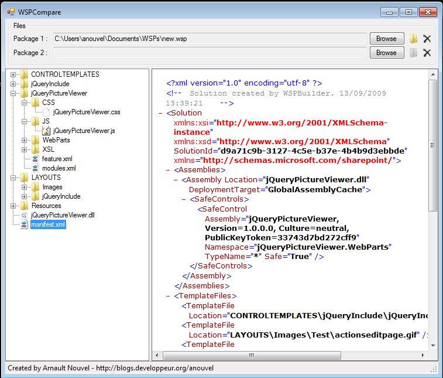
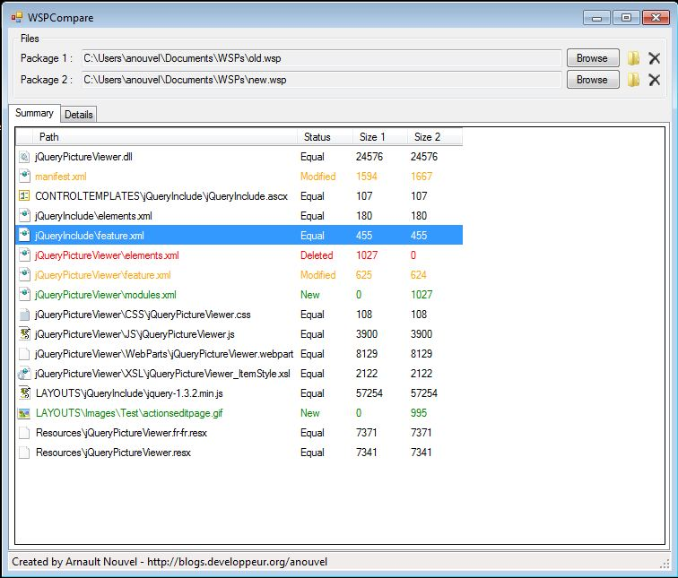
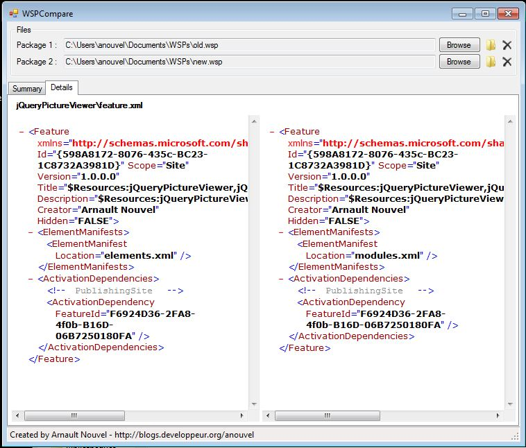

# WSPCompare

Browse and compare contents of .wsp files with this tool for SharePoint (all versions) developers and administrators

Downloads :
* [WSPCompare x64 (recommended)](README/WSPCompare.x64.zip)
* [WSPCompare x86 (for old SharePoint 2007 environments)](README/WSPCompare.x86.zip)

Browse the contents of any .wsp file :

Identify changes between 2 versions of a .wsp file :

Select a file and open the details tab to view both versions side by side :

*This project was originally hosted on Codeplex in 2009, migrated to GitHub in 2017*